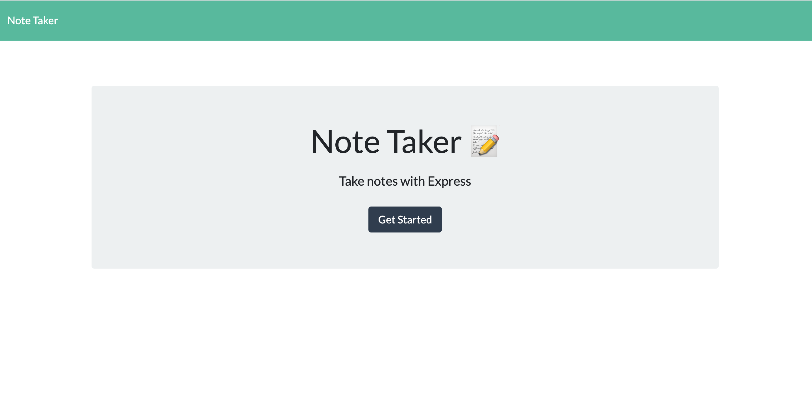
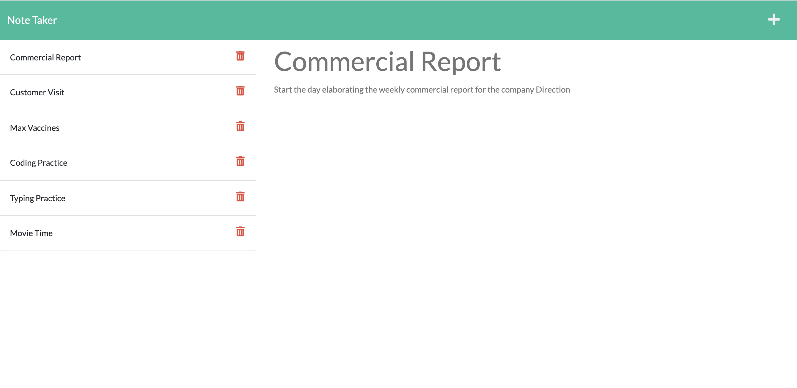
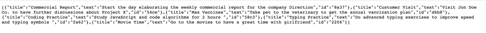

# u11-hw-express.js-note-taker
ITESM Coding Bootcamp - Unit 11 Homework - Express.js: Note Taker

## Description

This was an on-the-job ticket activity where I was given some files already coded (index.js, index.html, notes.html and style.css). My task was to create and code a sever.js file to be able to run the application with a server, so that, depending on the client's request, it could send the index.html or notes.html files, as well as have API functionality to allow the client to GET the notes saved in a db.json file, POST a new note to this file or DELETE a note from it (all this being relfected in the front-end of the appication).

First, I wrote the basic set-up to use the Express.js framework, creating an Express application in the server.js file. I also imported other modules like fs, util and path. Following this I defined the PORT variable using `const PORT = process.env.PORT || 3001;` to be able to deploy the app in Heroku. Next, I used some middleware to parse json and url encoded bodies, as well as to serve static files in the public directory. 

For the next part I coded the `GET / ` route to send the index.html file, a `GET /notes` to send the notes.html file, and a `GET *` to return the index.html file when users request an invalid route. Then, I set some functions, `const readFromFile`, `const writeToFile` and `const readAndAppend` to use the `fs` module to read and write data in the db.json file that would contain all the notes saved by the user. I also created a helpers directory with a uuid.js file containing a helper function to generate an id for each new note saved by the user. With those functions in place I coded the `GET /api/notes` route to send a response with the saved notes, the `POST /api/notes` route to take a request body from the user and save a new note, and the `DELETE /api/notes/:id` route to first read the notes in the db.json file, find the note with id requested by the user, remove it and write the remaining notes in the db.json file again.

Finally, I used `app.listen` to listen for connections and be able to start the application at `http://localhost:${PORT}`. 

## Usage

The application looks like this when it is used.

localhost:3001/ (GET)

localhost:3001/notes (GET)

 

localhost:3001/api/notes (GET)

The link to the deployed application through Heroku is this one:

https://jv-notetaker-app.herokuapp.com/

## Technologies Used

* JavaScript
* Express.js
* Node.js
* NPM
* File System (fs) module
* HTML
* CSS

## Contact Information

* GitHub Profile: [josevidmal](https://github.com/josevidmal)
* email: josevidmal@gmail.com

## License

[The MIT License](https://www.mit.edu/~amini/LICENSE.md)

Copyright 2022 Jose Vidal

Permission is hereby granted, free of charge, to any person obtaining a copy of this software and associated documentation files (the "Software"), to deal in the Software without restriction, including without limitation the rights to use, copy, modify, merge, publish, distribute, sublicense, and/or sell copies of the Software, and to permit persons to whom the Software is furnished to do so, subject to the following conditions:
    
The above copyright notice and this permission notice shall be included in all copies or substantial portions of the Software.
    
THE SOFTWARE IS PROVIDED "AS IS", WITHOUT WARRANTY OF ANY KIND, EXPRESS OR IMPLIED, INCLUDING BUT NOT LIMITED TO THE WARRANTIES OF MERCHANTABILITY, FITNESS FOR A PARTICULAR PURPOSE AND NONINFRINGEMENT. IN NO EVENT SHALL THE AUTHORS OR COPYRIGHT HOLDERS BE LIABLE FOR ANY CLAIM, DAMAGES OR OTHER LIABILITY, WHETHER IN AN ACTION OF CONTRACT, TORT OR OTHERWISE, ARISING FROM, OUT OF OR IN CONNECTION WITH THE SOFTWARE OR THE USE OR OTHER DEALINGS IN THE SOFTWARE.